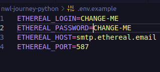

## Stack used


<br>

**Tests:** Pytest


## Authors
[@fandredev](https://www.linkedin.com/in/devfandre/)


## Installation:
### First, clone this repository.
```bash
git clone git@github.com:fandredev/nlw-journey-python.git
```

## Create virtual environment with Python

```bash
python -m venv venv
```
## OR
```bash
python3 -m venv venv
```

## Activate the virtual environment

```bash
source venv/bin/activate
```

## Install dependencies using pip
```bash
pip install -r requirements.txt
```
 
## Run development server
```bash
python run.py
```

## To create a fake email in Ethereal

``` 
python create_email.py
``` 

<h3> Please, check the .env.example to change your informations for send_email to work correctly





## Run ALL tests with pytest

``` 
pytest
``` 

## Run coverage with pytest
```bash
coverage run -m pytest
```

## Open coverage cover in HTML file
```bash
coverage html
```
<h4>After that, open the htmlcov folder and look for the index.html file.
Open it in your browser and the project coverage will be there</h4>


## Open coverage cover in terminal
```bash
coverage report -m
```

## Use collection
<h4>Use NWL Journey Python.postman_collection file to use the project routes</h4>


<br>


## Feedback

If you have any feedback, please let us know via profissionalf.andre@gmail.com

## References
 - [Rocketseat](https://www.linkedin.com/school/rocketseat)
 - [Flask](https://flask.palletsprojects.com/en/3.0.x/)
 - [Python](https://www.python.org/)
 - [Pytest](https://docs.pytest.org/)
 - [Ethereal email](https://ethereal.email/)
